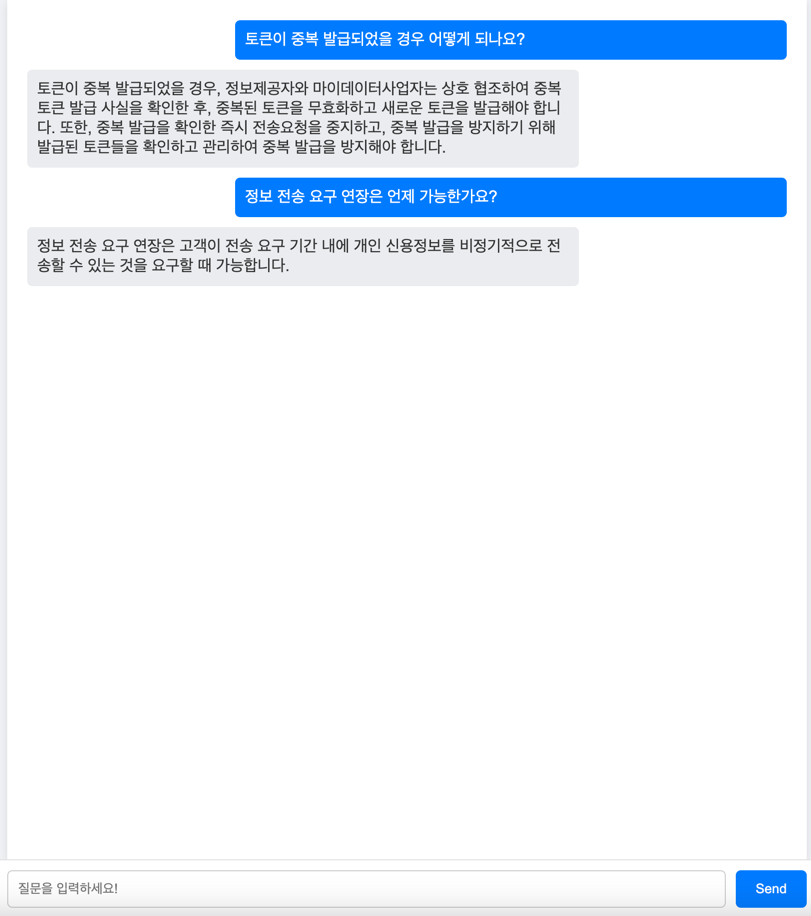
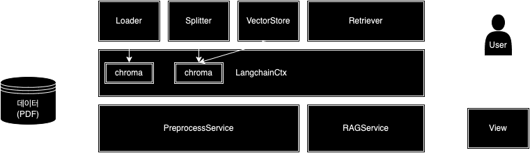

# Mydata-agent

## 목차
1. [프로젝트 실행 방법](#프로젝트-실행-방법)
2. [테스트 실행 방법](#테스트-실행-방법)
3. [사용 방법](#사용-방법)
4. [프로젝트 구조](#프로젝트-구조)
5. [API 문서](#API-문서)

### Python 버전
이 프로젝트는 Python의 LTS인 3.11에서 만들어졌습니다.  
#### 호환성 체크가 완료된 python version
- Python 3.11

## 프로젝트 실행 방법
프로그램을 실행하기 위해선 다음과 같은 절차를 따릅니다.

### 프로젝트 클론:
```bash
# 해당 프로젝트를 클론합니다.
git clone https://github.com/h32109/mydata-agent.git
```
### 필요 라이브러리 설치:
```bash
# 필요한 라이브러리를 설치합니다.
pip install -r requirements.txt

# unstructured와 충돌이 나는 package downgrade
pip uninstall onnxruntime
pip install onnxruntime==1.15.0
```
### 환경 변수 설정:
```bash
# 환경 변수 설정
export PROFILE="prod"

# OPENAI KEY 설정
mydata-agent/agent/config/prod.env
...
OPENAI_API_KEY="YOUR_API_KEY"
UNSTRUCTURED_API_KEY="YOUR_API_KEY"
...
```
### Unstructured Dependencies 설치:
```bash
# Mac의 경우
brew install libmagic poppler tesseract
# 윈도우, 리눅스의 경우 사이트 참고
https://docs.unstructured.io/open-source/installation/full-installation
```
### 애플리케이션 실행:
```bash
# 애플리케이션을 시작합니다.
uvicorn main:app
```

## 테스트 실행 방법
테스트 실행하기 위해선 다음과 같은 절차를 따릅니다.
### 필요 라이브러리 설치:
```bash
# 필요한 라이브러리를 설치합니다.
pip install -r requirements-test.txt
```
### 환경 변수 설정:
```bash
# OPENAI KEY 설정
mydata-agent/agent/config/test.env
...
OPENAI_API_KEY="YOUR_API_KEY"
UNSTRUCTURED_API_KEY="YOUR_API_KEY"
...
```
### 테스트 실행:
```bash
# 테스트를 시작합니다.
pytest --asyncio-mode=auto
```

## 사용 방법

* 웹 사용 방법:

  - `http://localhost:8000/agent` 접속
  - 
  - input란에 질문 입력 후 Send버튼 클릭


* API 사용 방법:

  - postman에 examples/Mydata-agent.postman_collection.json 다운로드 후 import 사용


## 프로젝트 구조
프로젝트 디렉토리 구조와 애플리케이션 구조를 소개합니다.



```
/mydata-agent
    /agent        # 프로젝트 폴더
      /cache       # Cache embedding local file store
      /config       # 환경변수 파일
      /context       # langchain, chroma 등 전역 context 관리자
      /core       # 환경변수 settings, logging 등 core 기능
      /data       # 프로젝트에 필요한 data(pdf 등)
      /preprocess  # 전처리(langchain) endpoint, schema, service
      /rag       # 사용자 경험 endpoint, schema, service
      /view       # 웹 뷰 endpoint, index.html
```


## API 문서
이 프로젝트의 API 문서는 다음과 같습니다.

### Preprocess load
- **경로**: `/api/v1/preprocess/load`
- **메소드**: `post`
- **설명**: Loader로 데이터를 읽은 결과를 반환합니다.
- - #### 요청 본문
| 필드명      | 타입   | 설명                                        | 필수 여부 |
|----------|------|-------------------------------------------|------|
| `loader` | str  | loader종류 ("py_loader", "unstructured_loader") | N     |
| `sync`   | bool | loader의 결과를 document store에 저장할지 여부        | N    |
- **요청 본문 예**:
  ```json
  {
      "loader": "py_loader",
      "sync": true
  }
  ```
- **응답 예**:
  ```json
  [
      {
          "id": null,
          "metadata": {
              "source": "",
              "page": 0
          },
          "page_content": "MyData API–ver 1.0\n금융분야 마이데이터 표준API 규격\n2021. 9.\n<< 안  내 >>\n본 표준 API 규격은 마이데이터사업자가 신용정보제공 ‧이용자등으로부터 개인\n신용정보를 안전하고 신뢰할 수 있는 방식으로 제공받기 위한 API 규격을 \n기술하고 있습니다 .\n본 표준 API 규격은 최신성 유지를 위해 마이데이터 테스트베드 홈페이지 \n및 마이데이터 지원센터 홈페이지를 통해 최신 내용임을 확인할 필요가 있\n습니다 .\n  \n",
          "type": "Document"
      },
      ...
  ]
  ```

### Preprocess chunk
- **경로**: `/api/v1/prerocess/chunk`
- **메소드**: `post`
- **설명**: document store에 저장된 documents를 Splitter로 chunking한 결과를 반환합니다.
- #### 요청 본문
| 필드명             | 타입  | 설명                                                                               | 필수 여부 |
|-----------------|-----|----------------------------------------------------------------------------------|-------|
| `splitter`    | int | splitter종류("recursive_character_spliter", "character_spliter", "konlpy_spliter") | N     |
| `sync`          | int | splitter의 결과를 chunked document store에 저장할지 여부                                    | N     |
| `chunk_size`    | int | chunking할 size                                                                   | N     |
| `chunk_overlap` | int | chunk시에 overlap할 수 있는 token 수                                                    | N     |
- **요청 본문 예**:
  ```json
  {
      "splitter": "konlpy_spliter",
      "chunk_size": 1000,
      "chunk_overlap": 200,
      "sync": true
  }
  ```
- **응답 예**:
  ```json
  [
      {
          "id": null,
          "metadata": {
              "page": 8,
              "source": "/Users/jong/Documents/workspaces/jong/mydata-agent/agent/data/mydata/(TEST) 금융분야 마이데이터 표준 API 규격.pdf"
          },
          "page_content": "v202105-1 “4.2 .3 카드 업권 API 목록“ 내 일부 잘못 표기된 resouce URI 수정 4.2.3 v202105-1“4.2 .9 통신 업권 API 목록” 내 “ 통신 거래 내역 ( 납 입 내역 ) 조회” API의 정기적 전송 주기 분류 값 변경( 추가 → 기본 )4.2 .9 v202105-1OAuth 관련 API( 개별 인증 , 통합 인증 등) 의 에러 메시지 (error _description) 의 데이터 타입 및 길이 변경 (aN (40) → AH(450)) 개별 인증 , 통합 인증 관련 API v202105-1 인가 코드 발급 요청 API( 개별 인증 -001) 일부 수정 Ÿ 요청 헤더에 정보주체 식별 값 (x-user -ci) 추가 ŸContent-type 수정 Ÿ 응답 메시지 명세 설명 추가 Ÿ 에러 메시지 명세에 상태 값 (state) 추가 Ÿ 정보 제공자가 앱 방식 개별 인증 수단을 제공할 수 있도록 요청 메시 지에 앱스 킴 추가 ŸCallback URL(redirect _uri) 의 데이터 길이 변경 (2048 → 100) 개별 인증 -001 v202105-1 접근 토큰 발급 요청 API( 개별 인증 -002) 일부 수정 ŸCallback URL(redirect _uri) 의 데이터 길이 변경 (2048 → 100) 개별 인증 -002 v202105-1 접근 토큰 갱신 API( 개별 인증 -003) 일부 수정 ŸHTTP Method 를 POST로 변경 Ÿ 리프 레 시 토큰 (refresh _token), 리프 레 시 토큰 유효기간 (refresh _token _expires _in), 권한 범위 (scope) 삭제 ( 리프 레 시토 큰이 갱신되는 경우가 없으며 , 권한 범위는 변동되지 않기 때문에 회신 이 불필요 ) 개별 인증 -003 v202105-1 접근 토큰 폐기 API( 개별 인증 -004) 일부 수정 ŸHTTP Method 를 POST로 변경 ŸContent-Type( 응답) 수정, 응답 메시지 명세 추가 Ÿ 폐기하고자 하는 토큰 (token) 의 설명 수정 ( “token _type _hint 미지 정시 접근 토큰 , 리프 레 시 토큰 모두 폐기” 문구 삭제) Ÿ 토큰 유형 (token _type _hint) 의 필수여부가 N 인 이유를 설명 추가 개별 인증 -004 v202105-1API 목록 조회 API( 정보제공 - 공통 -001) 일부 수정 Ÿ 제 4 장 -4.2.1 의 URI에서 <version> 을 “ 해당 없음 ”으로 수정 ( 버전 정 보를 조회하는 API의 URI에 <version> 이 표기되는 것은 부적 합하 다는 의견) ŸAPI 요청자에 종합 포털 추가 ( 신용 정보원 요청) ŸAPI 구분 코드 (api _code) 추가 및 API 명 (api _uri) 수정( <industry> 및 <version> 은 회신이 불필요하여 <resource> 만 회신하도록 수정) 정보제공 - 공통 -001 v202105-1 전송요구 내역 조회 API( 정보제공 - 공통 -002) 설명 일부 수정정보제공 - 공통 -002 v202105-1 개인형 IRP 거래 내역 조회 API(IRP-004) 일부 수정 Ÿ 거래 일시 (trans _dtime) 의 데이터 타입 및 자릿수 변경 (DTIME → DTIME 또는 DATE), 거래번호 (trans _no) 추가 IRP-004 v202105-1 은행업권 계좌 목록 조회 API( 은행 -001) 일부 수정 Ÿ 상품명 (prod _name) 의 길이를 최대 한글 100 자리 (AH (300 ))으로 변 경 ( 타 업권 상품명 길이와 통일) ŸAPI 설명에 마이너스 통장 관련 설명을 수정하고 , 응답 메시지에 마 은행 -001",
          "type": "Document"
      },
      ...
  ]
  ```

### Preprocess save vectorstore
- **경로**: `/api/v1/preprocess/vs`
- **메소드**: `post`
- **설명**: chunked document store의 데이터를 embedding후 verctor store를 저장합니다. 이후 시도되는 Retrive는 해당 vectorestore로 진행됩니다.
- #### 요청 본문
| 필드명             | 타입  | 설명                                                                                      | 필수 여부 |
|-----------------|-----|-----------------------------------------------------------------------------------------|-------|
| `embedding_model`    | str | embedding을 할 model 이름("ko_sbert_multitask", "kf_deberta_multitask", "bge_m3", "openai") | Y     |

- **요청 본문 예**:
  ```json
  {
      "embedding_model": "ko_sbert_multitask"
  }
  ```
- **응답 예**:
  ```json
  {
      "message": "Vector store saved successfully"
  }
  ```

### Preprocess symantic search
- **경로**: `/api/v1/preprocess/search`
- **메소드**: `post`
- **설명**: vectorstore에 semantic search를 한 결과를 반환합니다.
- #### 요청 본문
| 필드명     | 타입  | 설명        | 필수 여부 |
|---------|-----|-----------|-------|
| `query` | str | 검색값       | Y     |
| `k`     | int | 반환할 문서 개수 | N     |
- **요청 본문 예**:
  ```json
  {
      "query": "토큰이 중복 발급되었을 경우 어떻게 되나요?",
      "k": 10
  }
  ```
- **응답 예**:
  ```json
  [
      {
          "id": null,
          "metadata": {
              "page": 4,
              "source": "/Users/jong/Documents/workspaces/jong/mydata-agent/agent/data/mydata/(TEST) 금융분야 마이데이터 표준 API 규격.pdf"
          },
         "page_content": "(repay_org_code) 및 상환계좌번호 (repay_account_num) 의 필수여부\n를 선택(Y→N)으로 변경하고 설명 추가은행-008\nv202102-1카드 기본정보 조회 API(카드-002) 내 “브랜드 (코드)” 코드 추가\nŸ자릿수 변경(2→3)\nŸ코드 추가(별첨13)카드-002\n별첨13\nv202102-1포인트 정보 조회 API(카드-003) 일부 수정\nŸAPI 설명 추가\nŸ응답메시지 중 ”포인트 종류(코드)“를 ”포인트명 “으로 변경카드-003\nv202102-1청구 추가정보 조회 API(카드-005) 일부 수정\nŸ응답메시지 중 사용일시 (paid_dtime) 의 데이터 타입 및 자릿수 변\n경(DTIME → DTIME 또는 DATE), 이용금액 (paid_amt) 의 데이터 타\n입 및 자릿수 변경(N (15) → F (18, 3))카드-005\nv202102-1해외 승인내역 조회 API(카드-008) 일부 수정\nŸ응답메시지 중 이용금액 (approved_amt) 의 데이터 타입 및 자릿수 \n변경(N (15) → F (18, 3))카드-008",
          "type": "Document"
      },
      ...
  ]
  ```

### Rag retrieve
- **경로**: `/api/v1/rag/retrieve`
- **메소드**: `post`
- **설명**: ChatGPT를 사용한 retriever에 retireve한 결과를 반환합니다. embedding에 사용된 모델과 llm 모델의 이름을 반환합니다.
- #### 요청 본문
| 필드명          | 타입  | 설명                                     | 필수 여부 |
|--------------|-----|----------------------------------------|-------|
| `query`      | str | 검색값                                    | Y     |
| `chain_tpye` | str | chain type (stuff, map_reduce, refine) | N     |
| `retriever` | str | retriever type ("default", "multiquery_retriever", "ensemble_retriever")  | N     |
| `search_type` | str | search type (similarity, mmr)          | N     |

- **요청 본문 예**:
  ```json
  {
      "query": "토큰이 중복 발급되었을 경우 어떻게 되나요?",
      "chain_tpye": "stuff",
      "retriever": "ensemble_retriever",
      "search_type": "similarity"
  }
  ```
- **응답 예**:
  ```json
  {
      "msg": "Answer from chatGPT",
      "details": {
          "query": "토큰이 중복 발급되었을 경우 어떻게 되나요?",
          "result": "토큰이 중복 발급되었을 경우에 대한 명시적인 내용은 제공되지 않았습니다. 따라서 중복 발급된 토큰에 대한 처리 방법은 명시되지 않았습니다.",
          "source_documents": [
              {
                  "metadata": {
                      "source": "/",
                      "page": 7
                  },
                  "page_content": "v202105-1“3.2.1.1-  접근토큰 발급“ 일부 수정\nŸ정보제공용 접근토큰은 마이데이터사업자에 가입한 정보주체별로 \n1개 발급된다는 설명 추가 3.2.1.1- \nv202105-1“3.2.1.2 개인신용정보 전송요구 철회“ 내용 일부 수정\nŸ정보주체가 직접 철회 요청시 개별인증 -004 API가 호출되며 , 전송\n요구 변경으로 인해 기존 접근토큰이 폐기되는 경우는 본 API가 \n호출되지 않고 정보제공자 내부적으로 자체 폐기함을 명시3.2.1.2\nv202105-1“3.2.2.2 개인신용정보 전송요구 철회“ 내용 일부 수정\nŸ통합인증을 통해 발급된 접근토큰을 갱신 또는 폐기하고자 하는 \n경우에도 개별인증 -003 또는 개별인증 -004 API 호출함을 명시3.2.2.2"
              },
              ...
        ],
        "model": "gpt-3.5-turbo",
        "embedding_model": "jhgan/ko-sbert-multitask"
    }
  }
  ```
