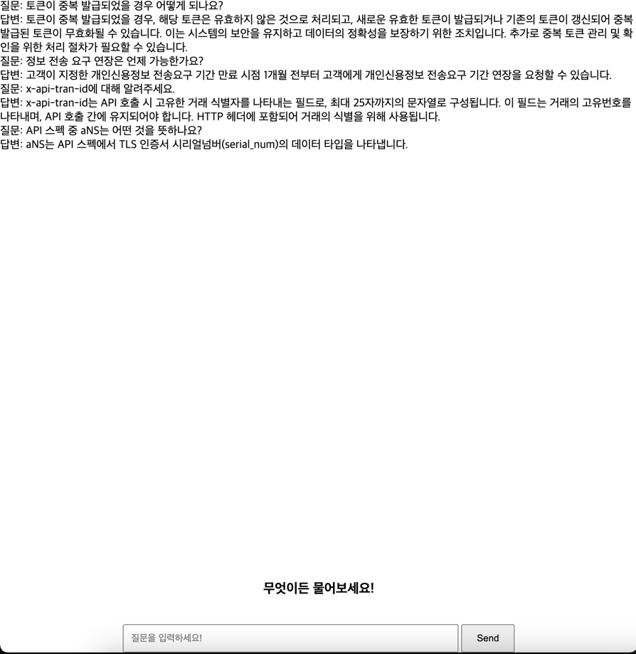

# Mydata-agent

## 목차
1. [프로젝트 실행 방법](#프로젝트-실행-방법)
2. [테스트 실행 방법](#테스트-실행-방법)
3. [사용 방법](#사용-방법)
4. [프로젝트 구조](#프로젝트-구조)
5. [API 문서](#API-문서)

### Python 버전
이 프로젝트는 Python의 LTS인 3.11에서 만들어졌습니다.  
#### 호환성 체크가 완료된 python version
- Python 3.11

## 프로젝트 실행 방법
프로그램을 실행하기 위해선 다음과 같은 절차를 따릅니다.

### 프로젝트 클론:
```bash
# 해당 프로젝트를 클론합니다.
git clone https://github.com/h32109/mydata-agent.git
```
### 필요 라이브러리 설치:
```bash
# 필요한 라이브러리를 설치합니다.
pip install -r requirements.txt
```
### 환경 변수 설정:
```bash
# 환경 변수 설정
export PROFILE="prod"

# OPENAI KEY 설정
mydata-agent/agent/config/prod.env
...
OPENAI_API_KEY=""
...
```
### 애플리케이션 실행:
```bash
# 애플리케이션을 시작합니다.
uvicorn main:app
```

## 테스트 실행 방법
테스트 실행하기 위해선 다음과 같은 절차를 따릅니다.
### 필요 라이브러리 설치:
```bash
# 필요한 라이브러리를 설치합니다.
pip install -r requirements-test.txt
```
### 테스트 실행:
```bash
# 테스트를 시작합니다.
pytest --asyncio-mode=auto
```

## 사용 방법

* 웹 사용 방법:

  - `http://localhost:8000/view` 접속

  - input란에 질문 입력 후 Send버튼 클릭


* API 사용 방법:

  - postman에 하단 collection 다운로드 후 import 사용
  - https://drive.google.com/file/d/1-OcNjiMGugQ5Gq8Re_tph5dfPFOGLMt2/view?usp=sharing


## 프로젝트 구조
프로젝트 디렉토리 구조와 애플리케이션 구조를 소개합니다.


```
/mydata-agent
    /agent        # 프로젝트 폴더
      /cache       # Cache embedding local file store
      /chatgpt       # 사용자 경험(chatgpt) endpoint, schema, service
      /config       # 환경변수 파일
      /core       # 환경변수 settings, logging 등 core 기능
      /data       # 프로젝트에 필요한 data(pdf 등) + faiss local store
      /langchain_       # 전처리(langchain) endpoint, schema, service
      /view       # 웹 뷰 endpoint, index.html
```


## API 문서
이 프로젝트의 API 문서는 다음과 같습니다.

### Langchain mydata load
- **경로**: `/api/v1/langchain/mydata`
- **메소드**: `get`
- **설명**: Loader로 mydata를 읽은 결과를 반환합니다.
- **응답 예**:
  ```json
  [
      {
          "id": null,
          "metadata": {
              "source": "/Users/jong/Documents/workspaces/jong/mydata-agent/agent/data/mydata/(수정게시) 금융분야 마이데이터 표준 API 규격 v1.pdf",
              "page": 0
          },
      ...
      }
  ]
  ```

### Langchain mydata chunk
- **경로**: `/api/v1/langchain/mydata/chunk`
- **메소드**: `post`
- **설명**: Spliter로 chunking한 결과를 반환합니다.
- #### 요청 본문
| 필드명             | 타입  | 설명                            | 필수 여부 |
|-----------------|-----|-------------------------------|-------|
| `chunk_size`    | int | chunking할 size                | N     |
| `chunk_overlap` | int | chunk시에 overlap할 수 있는 token 수 | N     |
- **요청 본문 예**:
  ```json
  {
      "chunk_size": 1000,
      "chunk_overlap": 200
  }
  ```
- **응답 예**:
  ```json
  [
      {
          "id": null,
          "metadata": {
              "source": "/",
              "page": 0
          },
          "page_content": "MyData API–ver 1.0\n금융분야 마이데이터 표준API 규격\n2021. 9.\n<< 안  내 >>\n본 표준 API 규격은 마이데이터사업자가 신용정보제공 ‧이용자등으로부터 개인\n신용정보를 안전하고 신뢰할 수 있는 방식으로 제공받기 위한 API 규격을 \n기술하고 있습니다 .\n본 표준 API 규격은 최신성 유지를 위해 마이데이터 테스트베드 홈페이지 \n및 마이데이터 지원센터 홈페이지를 통해 최신 내용임을 확인할 필요가 있\n습니다 .",
          "type": "Document"
      },
      ...
      }
  ]
  ```

### Langchain mydata set vectorstore
- **경로**: `/api/v1/langchain/mydata/vs`
- **메소드**: `post`
- **설명**: 데이터를 load하고 chunking한 후 vectorestore에 저장합니다. 이후 시도되는 Retrive는 해당 vectorestore로 진행됩니다.
- #### 요청 본문
| 필드명             | 타입  | 설명                             | 필수 여부 |
|-----------------|-----|--------------------------------|-------|
| `model_name`    | str | embedding을 할 sentence model 이름 | Y     |

- **요청 본문 예**:
  ```json
  {
      "model_name": "jhgan/ko-sbert-multitask"
  }
  ```
- **응답 예**:
  ```json
  201 CREATED
  ```

### Langchain mydata symantic search
- **경로**: `/api/v1/langchain/mydata/search`
- **메소드**: `post`
- **설명**: vectorstore에 semantic search를 한 결과를 반환합니다. model_name엔 embedding에 쓰인 모델 이름을 반환합니다.
- #### 요청 본문
| 필드명     | 타입  | 설명        | 필수 여부 |
|---------|-----|-----------|-------|
| `query` | str | 검색값       | Y     |
| `k`     | int | 반환할 문서 개수 | N     |
- **요청 본문 예**:
  ```json
  {
      "query": "토큰이 중복 발급되었을 경우 어떻게 되나요?",
      "k": 10
  }
  ```
- **응답 예**:
  ```json
  {
      "documents": [
          {
              "id": null,
              "metadata": {
                  "source": "/Users/jong/Documents/workspaces/jong/mydata-agent/agent/data/mydata/(수정게시) 금융분야 마이데이터 표준 API 규격 v1.pdf",
                  "page": 306
              },
      ...
      "model_name": "jhgan/ko-sbert-multitask"
  }
  ```

### ChatGPT mydata retrieve
- **경로**: `/api/v1/chatgpt/mydata/retrieve`
- **메소드**: `post`
- **설명**: ChatGPT를 사용한 retriever에 retireve한 결과를 반환합니다. embedding에 사용된 모델과 llm 모델의 이름을 반환합니다.
- #### 요청 본문
| 필드명          | 타입  | 설명                                     | 필수 여부 |
|--------------|-----|----------------------------------------|-------|
| `query`      | str | 검색값                                    | Y     |
| `chain_tpye` | str | chain type (stuff, map_reduce, refine) | N     |
| `retriever_type` | str | retriever type (default, multi_query)  | N     |
| `search_type` | str | search type (similarity, mmr)          | N     |

- **요청 본문 예**:
  ```json
  {
      "query": "토큰이 중복 발급되었을 경우 어떻게 되나요?",
      "chain_tpye": "map_reduce",
      "retriever_type": "multi_query",
      "search_type": "similarity"
  }
  ```
- **응답 예**:
  ```json
  {
      "msg": "Answer from chatGPT",
      "details": {
          "query": "토큰이 중복 발급되었을 경우 어떻게 되나요?",
          "result": "토큰이 중복 발급되었을 경우에 대한 명시적인 내용은 제공되지 않았습니다. 따라서 중복 발급된 토큰에 대한 처리 방법은 명시되지 않았습니다.",
          "source_documents": [
              {
                  "metadata": {
                      "source": "/",
                      "page": 7
                  },
                  "page_content": "v202105-1“3.2.1.1-  접근토큰 발급“ 일부 수정\nŸ정보제공용 접근토큰은 마이데이터사업자에 가입한 정보주체별로 \n1개 발급된다는 설명 추가 3.2.1.1- \nv202105-1“3.2.1.2 개인신용정보 전송요구 철회“ 내용 일부 수정\nŸ정보주체가 직접 철회 요청시 개별인증 -004 API가 호출되며 , 전송\n요구 변경으로 인해 기존 접근토큰이 폐기되는 경우는 본 API가 \n호출되지 않고 정보제공자 내부적으로 자체 폐기함을 명시3.2.1.2\nv202105-1“3.2.2.2 개인신용정보 전송요구 철회“ 내용 일부 수정\nŸ통합인증을 통해 발급된 접근토큰을 갱신 또는 폐기하고자 하는 \n경우에도 개별인증 -003 또는 개별인증 -004 API 호출함을 명시3.2.2.2"
              },
              ...
        ],
        "model": "gpt-3.5-turbo",
        "embedding_model": "jhgan/ko-sbert-multitask"
    }
  }
  ```
